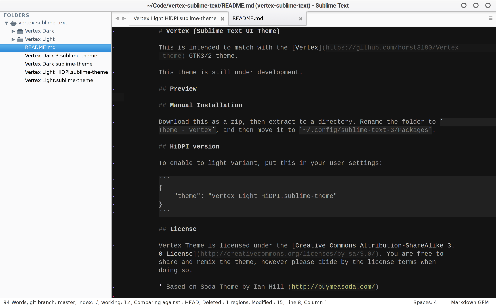

# Vertex (Sublime Text UI Theme)

This is intended to match with the [Vertex](https://github.com/horst3180/Vertex-theme) GTK3/2 theme. 

This theme is still under development.

## Preview



## Manual Installation

Download this as a zip, then extract to a directory. Rename the folder to `Theme - Vertex`, and then move it to `~/.config/sublime-text-3/Packages`.

## HiDPI version

To enable to light variant, put this in your user settings:

```
{
    "theme": "Vertex Light HiDPI.sublime-theme"
}
```

## License

Vertex Theme is licensed under the [Creative Commons Attribution-ShareAlike 3.0 License](http://creativecommons.org/licenses/by-sa/3.0/). You are free to share and remix the theme, however please abide by the license terms when doing so.

* Based on Soda Theme by Ian Hill (http://buymeasoda.com/)

